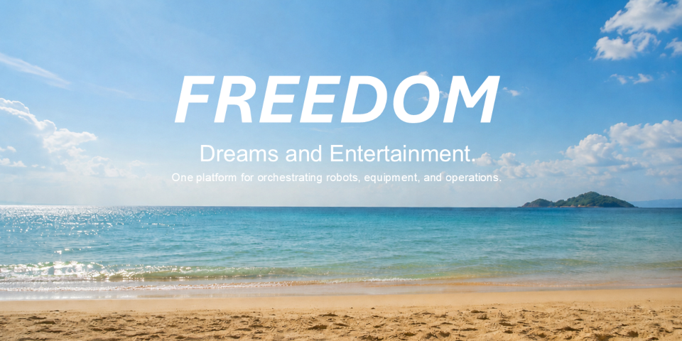
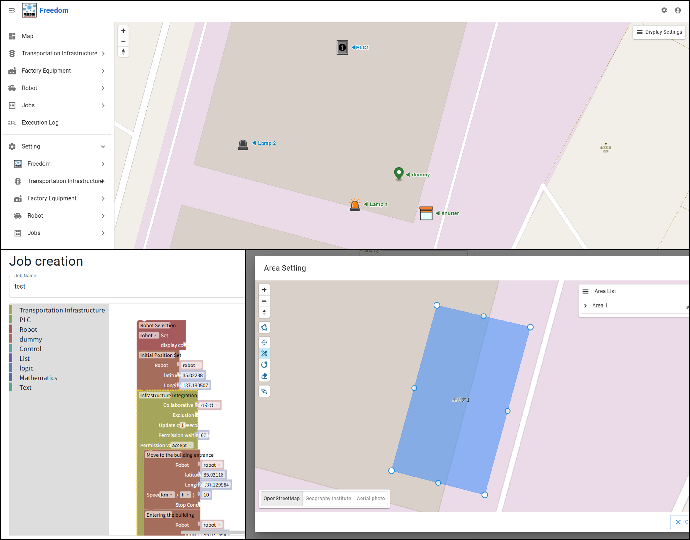

  

  
  
  
  
  
  
  
  

 

[日本語版READMEはこちら](README_ja.md)

> A unified platform for orchestrating robots and factory infrastructure.

## Introduction
FREEDOM is a fleet management and orchestration platform for AMRs and other transport robots, designed to seamlessly coordinate robot operations with plant infrastructure systems.
In addition to typical Warehouse Control System (WCS) capabilities, FREEDOM provides the following features:

- **Unified Portal**  
   By integrating various robot APIs, FREEDOM enables control of multiple robot types with different coordinate systems. FREEDOM provides a unified dashboard that visualizes the status of all equipment in real time, improving operational efficiency for on-site workers.
- **Job Creator**  
   Users can create a sequence (job) consisting of multiple tasks via the Web UI, enabling on-site workers to independently implement Kaizen (continuous improvement).
- **Infrastructure-linked zones**  
   Users can draw zones on the Web UI that are linked to internal traffic infrastructure devices such as signal lamps or shutters, specifying where these devices should be triggered. This function makes on-site adjustment easier.

 

  

## Who is this for?
- Factory automation engineers
- Robotics system integrators
- Developers building Warehouse Control Systems (WCS) and robotics platforms

## Terminology
This project defines the following terms to avoid ambiguity.

- **Repository**  
   A logical unit representing a functional category within FREEDOM.
   It corresponds to the directory structure `backend/src/<repository>/`.  
   This concept is inspired by the Repository pattern used in Domain-Driven Design (DDD) and Clean Architecture, and is defined as a unit for grouping related functionality.  
   The five repositories are: `freedom`, `job`, `robot`, `infrastructure`, and `equipment`.

- **Node**  
   An execution unit (service or functional module) with a specific responsibility.
   It corresponds to the directory structure `backend/src/<repository>/<node>/`.  
   For example, `backend/src/robot/dummy` represents the `dummy` node that belongs to the `robot` repository.

**Note:**  
The term "repository" in this project does **not** refer to a GitHub repository (a remote code management unit), but rather to a functional category within FREEDOM.  
While the concept is inspired by the Repository pattern in DDD and Clean Architecture, it does not represent a data access layer itself.  
In this README, when referring to a repository hosted on GitHub, the term **"GitHub repository"** will be used explicitly.

## System Architecture
FREEDOM follows a microservices architecture and is composed of multiple nodes (services), each with an independent function.
Each node must belong to exactly one “repository” (functional category). In terms of directory layout, a node is located at `backend/src/<repository>/<node>/`.

For example, to integrate your new AMR into FREEDOM, you need to implement a custom node that contains the AMR’s API commands and place it under the `robot` repository (`backend/src/robot/<your_amr_node>`).
- [freedom](backend/src/freedom) - Core program of FREEDOM (`freedom` repository)
- [job](backend/src/job) - Job creation and execution (`job` repository)
- [robot](backend/src/robot) - Robot control (`robot` repository)
- [infrastructure](backend/src/infrastructure) - Internal traffic infrastructure control (`infrastructure` repository)
- [equipment](backend/src/equipment) - Plant equipment integration (`equipment` repository)

### Node overview
| Repository / Node | Description |
|---|---|
| [freedom/main](backend/src/freedom/main) | Responsible for starting and updating all other nodes |
| [freedom/user_interface](backend/src/freedom/user_interface) | Web API implementation (frontend integration) |
| [freedom/map](backend/src/freedom/map) | Map rendering |
| [freedom/log](backend/src/freedom/log) | Logging |
| [freedom/authz](backend/src/freedom/authz) | User authorization |
| [job/active](backend/src/job/active) | Job execution |
| [job/create](backend/src/job/create) | Job creation |
| [job/task](backend/src/job/task) | Task block definitions |
| [robot/dummy](backend/src/robot/dummy) | Dummy robot (for demos) |
| [infrastructure/lamp](backend/src/infrastructure/lamp) | Signal lamp on/off control |
| [infrastructure/shutter](backend/src/infrastructure/shutter) | Shutter open/close control |
| [infrastructure/gate](backend/src/infrastructure/gate) | Gate open/close status check |
| [infrastructure/intersection](backend/src/infrastructure/intersection) | Virtual intersection control |
| [equipment/iotdatashare](backend/src/equipment/iotdatashare) | Integration with FA communication software “IoT Data Share” (*1) |
| [equipment/plc](backend/src/equipment/plc) | Generic PLC integration |

(*1) IoT Data Share is a product provided by DENSO WAVE INCORPORATED.  
This project includes an interface for accessing the Web API provided by IoT Data Share. However, this project does not incorporate, bundle, modify, or redistribute IoT Data Share itself or any software components constituting the product.
Furthermore, this project is not developed, provided, or supported by DENSO WAVE INCORPORATED, nor does it imply any approval, endorsement, or warranty by DENSO WAVE INCORPORATED with respect to this project.
Any use of IoT Data Share is subject to the contractual terms and conditions and any other applicable terms of use separately established for that product.

## Installation
### Run from a package
Pre-built packages are not yet available.

### Quick Start (Recommended)
Follow the install guide to run FREEDOM locally:
👉 [Install Guide](docs/install.md)

After installation, you can access the Web UI at:
http://localhost:3000

#### Requirements
| Item | Version |
|---|---|
| Python | `3.13` |
| Node.js | `24+` |
| PostgreSQL | `16+` |

## Usage
The setup guide and user manual are currently under preparation (planned for release in 2026).

In the meantime:
- Refer to the Install Guide for environment configuration
- Create a sample job and run a demonstration where a dummy robot passes through an infrastructure-linked zone using the Web UI
- Explore each repository for example implementations

## License
This project is licensed under the [Apache License, Version 2.0](LICENSE).  
This License applies solely to FREEDOM released under this project.
Any version of FREEDOM developed on or before December 31, 2025 (the "Prior Version") is excluded from the scope of this License.
For the avoidance of doubt, this License neither modifies nor affects any contract, license, or other terms and conditions previously established with respect to the Prior Version.

## Contribution
Thank you for your interest in this project.
We are currently preparing the workflow and guidelines for accepting external pull requests (planned to start within 2026). Contributions are highly welcome once the guidelines are published.
Until then, we would appreciate it if you could report bugs and feature requests via GitHub Issues.

## Maintainers
FREEDOM is currently maintained by:
- Yasuaki Miyahara (TOYOTA MOTOR CORPORATION)
- Akio Sakuraba (TOYOTA MOTOR CORPORATION)
- Kotaro Nagahiro (TOYOTA MOTOR CORPORATION)
- Koyo Katagiri (TOYOTA MOTOR CORPORATION)
- Taiki Hisamitsu (TOYOTA MOTOR CORPORATION)
- Shogo Noguchi (TOYOTA PRODUCTION ENGINEERING)

## Contact
For bug reports and feature requests, please open an Issue.
We will review your request and respond as far as reasonably possible.
