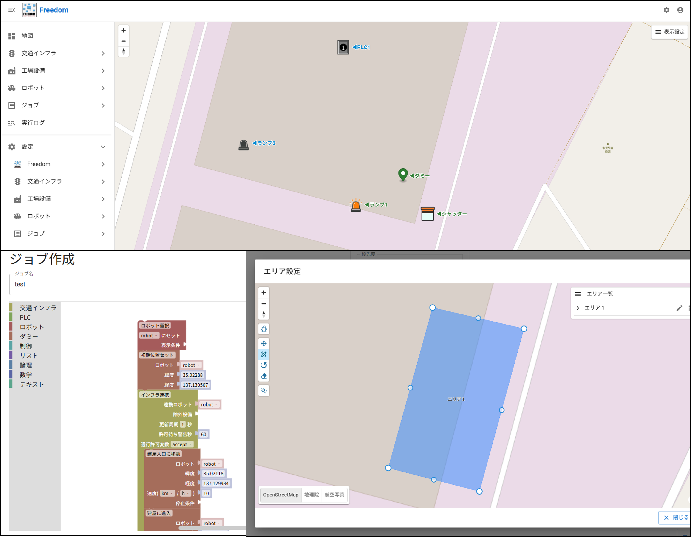

  

  
  
  
  
  
  
  
  

 

## はじめに
FREEDOMは、AMRをはじめとする搬送ロボットを、工場内の各種インフラ設備と連携させて運用するための管制システムです。  
一般的な倉庫制御システム（WCS）の機能に加え、以下の特徴があります。

- **ワンポータル化**  
   各種ロボットのAPIを取り込むことで、異なる座標系を持つ複数種のロボットを1つのFREEDOMから制御でき、現場作業者の負担を軽減できます。
- **ジョブ作成機能**  
   複数のタスクを組み合わせた1つのシーケンス（ジョブ）をWeb UI上で作成でき、現場作業者が自らの手で改善に取り組めます。
- **インフラ連携エリア**  
   回転灯やシャッターなど、各種インフラを作動させるエリアをWeb UI上で設定でき、現場での調整が容易になります。

 

  

## 対象ユーザー
FREEDOMは主に以下のユーザーを対象としています。
- 工場の物流自動化エンジニア
- ロボットシステムインテグレータ
- WCSなどの倉庫制御システムを開発するソフトウェアエンジニア

## 用語解説
本プロジェクトでは、混在しやすい用語を次のように定義します。
- **リポジトリ（repository）**  
   FREEDOM内部での「機能カテゴリ」を表す論理単位です。
   ディレクトリ構造としては `backend/src/<repository>/` に対応します。  
   この概念は、ドメイン駆動設計（DDD）やクリーンアーキテクチャにおける Repository の考え方を参考にしており、関連する機能をまとめる単位として定義しています。  
   `freedom`, `job`, `robot`, `infrastructure`, `equipment` の5つが存在します。
- **ノード（node）**  
   特定の役割を持つ実行単位（サービス/機能モジュール）です。
   ディレクトリ構造としては `backend/src/<repository>/<node>/` に対応します。  
   例：`backend/src/robot/dummy` は「`robot` リポジトリに属する `dummy` ノード」を表します。

**注意:**  
ここでいう「リポジトリ」は、GitHub上のリポジトリ（リモートのコード管理単位）ではなく、FREEDOM内部の機能カテゴリを表す用語です。  
DDDやクリーンアーキテクチャにおける Repository の設計思想を参考にしていますが、データアクセス層そのものを指すものではありません。  
本READMEでは、GitHub上のリポジトリを指す場合は「GitHubリポジトリ」と明示します。

## システム構成
FREEDOM はマイクロサービスアーキテクチャの設計思想に基づいており、
独立した機能を持つ複数のノード（サービス）の組み合わせによって構成されています。

各ノードは、いずれか 1 つの「リポジトリ（機能カテゴリ）」に属します。
ディレクトリ構造としては `backend/src/<repository>/<node>/` の形になります。  
例えば、あるAMRをFREEDOMに取り込む場合、そのAMRのAPIコマンドを含むカスタムノードを作成し、`robot` リポジトリ配下（`backend/src/robot/<your_amr_node>`）に配置します。

- [freedom](backend/src/freedom) - FREEDOMの基幹プログラム（`freedom`リポジトリ）
- [job](backend/src/job) - ジョブ作成・実行（`job`リポジトリ）
- [robot](backend/src/robot) - ロボット制御（`robot`リポジトリ）
- [infrastructure](backend/src/infrastructure) - 交通インフラ制御（`infrastructure`リポジトリ）
- [equipment](backend/src/equipment) - 工場設備連携（`equipment`リポジトリ）

### 各ノードの機能説明
| リポジトリ / ノード | 説明 |
|---|---|
| [freedom/main](backend/src/freedom/main) | main以外の各ノードの起動・更新 |
| [freedom/user_interface](backend/src/freedom/user_interface) | Web API機能（フロントエンド連携） |
| [freedom/map](backend/src/freedom/map) | 地図表示機能 |
| [freedom/log](backend/src/freedom/log) | ログ出力機能 |
| [freedom/authz](backend/src/freedom/authz) | ユーザ認証機能 |
| [job/active](backend/src/job/active) | ジョブ実行機能 |
| [job/create](backend/src/job/create) | ジョブ作成機能 |
| [job/task](backend/src/job/task) | タスクブロック定義 |
| [robot/dummy](backend/src/robot/dummy) | ダミーロボット（動作検証用） |
| [infrastructure/lamp](backend/src/infrastructure/lamp) | ランプ点灯/消灯制御 |
| [infrastructure/shutter](backend/src/infrastructure/shutter) | シャッター開閉制御 |
| [infrastructure/gate](backend/src/infrastructure/gate) | ゲート通過可/不可チェック |
| [infrastructure/intersection](backend/src/infrastructure/intersection) | バーチャル交差点制御 |
| [equipment/iotdatashare](backend/src/equipment/iotdatashare) | FA機器通信ソフトウェア IoT Data Share (*1)連携機能 |
| [equipment/plc](backend/src/equipment/plc) | PLC連携機能 |
| [equipment/database](backend/src/equipment/database) | データベース連携機能 |

(*1)　IoT Data Shareは、株式会社デンソーウェーブが提供する製品です。  
本プロジェクトには、IoT Data Shareが提供するWeb APIとの連携に用いるインターフェース機能が含まれますが、
IoT Data Share本体又は同製品を構成するプログラムを組み込み、同梱し、改変し、若しくは再配布するものではありません。
また、本プロジェクトは株式会社デンソーウェーブが開発、提供又はサポートするものではなく、同社による本プロジェクトの承認、推奨又は保証を示すものでもありません。
IoT Data Shareを利用する場合には、同製品について定められた契約条件その他の利用条件が別途適用されます。

## インストール
### パッケージから実行
現在、ビルド済みパッケージは公開しておりません。

### クイックスタート（推奨）
以下のインストール手順に従い、ローカル環境でFREEDOMを起動してください。
📖 [インストールガイドはこちら](docs/install_ja.md)

#### 環境要件
| 項目 | バージョン |
|---|---|
| Python | `3.13` |
| Node.js | `24+` |
| PostgreSQL | `16+` |

## 使用方法
現在、本番環境セットアップガイドおよびユーザマニュアルは準備中です（2026年内公開予定）。
現時点では以下を参考にしてください。
- インストールガイドに従って開発環境構築
- Web UI上でジョブを作成し、ダミーロボットが交通インフラエリアを通過するデモを試す
- 各リポジトリ配下のコードを参照して機能拡張

## ライセンス
本プロジェクトは [Apache License, Version 2.0](LICENSE) の下で公開されています。  
本ライセンスは、本プロジェクトとして公開されるFREEDOMにのみ適用されます。
2025年12月31日以前に開発されたFREEDOM（以下「旧版」といいます。）は、本ライセンスの対象に含まれません。
また、本ライセンスは、旧版について従前締結された契約、ライセンスその他の利用条件を変更し、又はこれらに影響を及ぼすものではありません。

## コントリビューション
本プロジェクトに関心をお持ちいただきありがとうございます。
現在、外部からのPull Requestを受け付けるための体制・ガイドラインを整備中です（2026年内に開始予定）。
それまでの間は、バグ報告や機能要望についてはIssueでお知らせいただけると助かります。

## 開発・保守メンバー
FREEDOM は現在、以下のメンバーによって開発・保守されています。
- 宮原 康晃（トヨタ自動車㈱）
- 櫻庭 彬生（トヨタ自動車㈱）
- 永廣 幸太郎（トヨタ自動車㈱）
- 片桐 康陽（トヨタ自動車㈱）
- 久光 大輝（トヨタ自動車㈱）
- 野口 奨悟（委託：㈱トヨタプロダクションエンジニアリング）

## お問い合わせ
バグ報告や機能要望については、Issue を作成してください。
内容を確認のうえ、可能な範囲で対応いたします。
